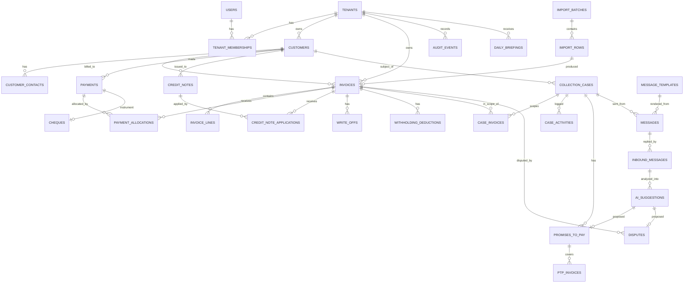

# 04 — PostgreSQL Entity Model

Status: DRAFT, amended by slice 1 (DM-06, DM-06a, DM-06b), slice 2 (DM-20a), slice 3 (DM-23a), slice 3b (DM-24a), slice 4 (DM-31a), slice 5 (DM-25a), slice 6 (DM-24a) and slice 7 (DM-26a). The DDL below is **illustrative
specification**, not a migration.
Migrations are written inside their vertical slice (doc 10) and must match this
document or amend it.

Target: PostgreSQL 16+ with `pgvector`. Naming: `snake_case`, plural tables,
`id` primary keys, `created_at`/`updated_at` on everything.

---

## 1. Tenancy strategy

**Shared database, shared schema, `tenant_id` on every business row, enforced by three
independent layers.** See ADR-0001 for why not schema-per-tenant or database-per-tenant
at pilot scale (A-15, A-16).

| Layer | Mechanism | Catches |
|-------|-----------|---------|
| L1 — Application | EF Core global query filter on `ITenantScoped`, tenant resolved from the **validated access token**, never from a header, body, or query parameter | The 95% case |
| L2 — Database | PostgreSQL **Row-Level Security** on every business table, keyed on `current_setting('app.tenant_id')`, set per connection/transaction from the same validated context | Raw SQL, Dapper queries, reporting code, a forgotten `IgnoreQueryFilters()`, a future bug |
| L3 — Schema | **Composite foreign keys** carrying `tenant_id` (§3.3) | Cross-tenant *references* — a payment in tenant A allocated to an invoice in tenant B — which L1 and L2 alone do not prevent |

**DM-01** Every business table MUST have `tenant_id uuid NOT NULL REFERENCES tenants(id)`.
**DM-02** Every business table MUST have RLS enabled **and forced** (`FORCE ROW LEVEL SECURITY`,
so the table owner is not exempt).
**DM-03** The application connects as a role that is **not** the table owner and does
**not** have `BYPASSRLS`. Migrations use a separate, privileged role.
**DM-04** A schema test enumerates `pg_class` and fails if any business table lacks
`tenant_id`, lacks RLS, or lacks a policy (doc 09 §4.2). This test runs on every build.

### 1.1 The tenant context

```sql
-- Set once per request, inside the transaction, from the validated principal.
SELECT set_config('app.tenant_id', $1, true);   -- true = transaction-scoped
SELECT set_config('app.user_id',   $2, true);
```

```sql
CREATE POLICY tenant_isolation ON invoices
  USING      (tenant_id = current_setting('app.tenant_id', true)::uuid)
  WITH CHECK (tenant_id = current_setting('app.tenant_id', true)::uuid);
```

**DM-05** `current_setting('app.tenant_id', true)` returning NULL MUST make the policy
fail closed (no rows), never open. Policies are written so a missing setting yields
`NULL = ...` → NULL → not true → **no rows**. There MUST be an integration test that
opens a connection without setting the GUC and asserts zero rows from every table.

**DM-06** Platform-level tables (`tenants`, `users`, `tenant_memberships`, `refresh_tokens`,
migration history) are reachable only by explicitly platform-scoped code paths, which are
individually reviewed.

> **Amended in slice 1.** The original text exempted these tables from RLS entirely. As built they
> are *not* exempt: every one of them has RLS enabled and forced, and the identity flows that must
> run before a tenant is known (login, refresh, registration, "which organizations do I belong
> to") open a **platform scope** — a transaction-local `app.platform_scope = 'on'` — rather than
> running unprotected.
>
> - `tenants` is visible when `id = app_current_tenant()`, or in platform scope.
> - `users` is visible in platform scope, or — inside a tenant-scoped request — only to co-members
>   of the current tenant, so "list my organization's members" cannot reach a stranger. A user may
>   always update their own row (`PATCH /me`).
> - `tenant_memberships` and `refresh_tokens` follow the ordinary tenant policy, plus platform scope.
> - `tenant_settings` and `audit_events` have **no platform clause at all**: business data always
>   requires a real tenant, so even an identity flow cannot read them without one.
>
> Platform scope is opened by exactly one file, `PlatformIdentityStore`. A static test over the
> source tree fails the build if any other file calls it, and a second test confines
> `IgnoreQueryFilters()` to that file and the audit writer. This is strictly stronger than the
> original DM-06 and keeps the escape hatch reviewable.

**DM-06a** `refresh_tokens` (added in slice 1) stores opaque, rotating refresh tokens with family
revocation (SEC-04). Only the SHA-256 of each token is stored. Its foreign key is composite —
`(tenant_id, user_id) REFERENCES tenant_memberships (tenant_id, user_id)` — so a session for a
tenant the user is not a member of is unrepresentable (layer 3, DM-10).

```sql
CREATE TABLE refresh_tokens (
  id             uuid PRIMARY KEY,
  tenant_id      uuid NOT NULL REFERENCES tenants(id),
  user_id        uuid NOT NULL REFERENCES users(id),
  family_id      uuid NOT NULL,
  token_hash     text NOT NULL UNIQUE,
  issued_at      timestamptz NOT NULL DEFAULT now(),
  expires_at     timestamptz NOT NULL,
  rotated_at     timestamptz NULL,
  revoked_at     timestamptz NULL,
  revoked_reason text NULL
                 CHECK (revoked_reason IN ('rotated','logout','reuse_detected','superseded')),
  CONSTRAINT refresh_tokens_tenant_id_key UNIQUE (tenant_id, id),
  CONSTRAINT fk_refresh_token_membership
    FOREIGN KEY (tenant_id, user_id) REFERENCES tenant_memberships (tenant_id, user_id)
);
```

**DM-06b** `tenants` carries `row_version bigint NOT NULL DEFAULT 1` (added in slice 1). §3.1 puts
`row_version` on every table for optimistic concurrency (API-09) but §4's `tenants` DDL omitted it;
the column is required for `PATCH /organization` to honour `If-Match`.

---

## 2. Entity map



---

## 3. Core conventions

### 3.1 Every table

```sql
id           uuid PRIMARY KEY DEFAULT gen_random_uuid(),
tenant_id    uuid NOT NULL,
created_at   timestamptz NOT NULL DEFAULT now(),
created_by   uuid NULL,                 -- users.id, NULL for system
updated_at   timestamptz NOT NULL DEFAULT now(),
updated_by   uuid NULL,
row_version  bigint NOT NULL DEFAULT 1  -- optimistic concurrency (SM-07)
```

**DM-07** UUIDv7 (time-ordered) is generated in the application for index locality;
`gen_random_uuid()` is the DB fallback. IDs are never sequential integers — enumerable
IDs across tenants are an information leak even with RLS.

**DM-08** Soft delete only where a business reason exists (`customers`, `message_templates`)
via `deleted_at timestamptz NULL` plus a partial index. **Financial rows are never
deleted** — they are reversed (FIN-23).

### 3.2 Money columns

**DM-09** Money is `numeric(19,3)` with a mandatory sibling `*_currency char(3)`
(FIN-01..FIN-03). A schema test enforces this on every column whose name ends in
`_amount`, `_balance`, or `_total` (INV-11).

### 3.3 Composite foreign keys (the L3 layer)

A plain `FOREIGN KEY (invoice_id) REFERENCES invoices(id)` permits a row in tenant A
to reference an invoice in tenant B if application code is ever wrong. We prevent that
structurally:

```sql
-- Parent exposes a tenant-qualified unique key
ALTER TABLE invoices ADD CONSTRAINT invoices_tenant_id_key UNIQUE (tenant_id, id);

-- Child references it, so the tenant must match by construction
ALTER TABLE payment_allocations
  ADD CONSTRAINT fk_alloc_invoice
  FOREIGN KEY (tenant_id, invoice_id) REFERENCES invoices (tenant_id, id);
```

**DM-10** Every foreign key between two business tables MUST be composite on
`(tenant_id, …)`. A schema test enumerates `information_schema.referential_constraints`
and fails on any single-column FK between business tables (doc 09 §4.2). This is the
one control that makes cross-tenant data corruption structurally impossible rather
than merely tested-for.

### 3.4 Enums

**DM-11** State values are `text` + `CHECK` constraint (SM-01), mirrored by a C# enum
with a round-trip test. PostgreSQL `ENUM` types are avoided because adding a value
requires DDL that is awkward inside a transactional migration.

---

## 4. Platform tables

```sql
CREATE TABLE tenants (
  id                    uuid PRIMARY KEY,
  name                  text NOT NULL,
  legal_name            text NULL,
  tax_registration_no   text NULL,               -- Jordanian TIN, free text, not validated in v1
  base_currency         char(3) NOT NULL DEFAULT 'JOD',
  timezone              text NOT NULL DEFAULT 'Asia/Amman',
  default_locale        text NOT NULL DEFAULT 'ar-JO' CHECK (default_locale IN ('ar-JO','en-JO')),
  status                text NOT NULL DEFAULT 'Active'
                        CHECK (status IN ('Active','Suspended','Closed')),
  created_at            timestamptz NOT NULL DEFAULT now(),
  row_version           bigint NOT NULL DEFAULT 1        -- optimistic concurrency (API-09, DM-06b)
);

CREATE TABLE users (                              -- global identity, not tenant-scoped
  id                 uuid PRIMARY KEY,
  email              citext NOT NULL UNIQUE,
  email_verified_at  timestamptz NULL,
  password_hash      text NULL,                   -- Argon2id; NULL if SSO-only later
  full_name          text NOT NULL,
  preferred_locale   text NOT NULL DEFAULT 'ar-JO',
  mfa_secret_enc     bytea NULL,
  status             text NOT NULL DEFAULT 'Active'
                     CHECK (status IN ('Invited','Active','Disabled')),
  failed_login_count int NOT NULL DEFAULT 0,
  locked_until       timestamptz NULL,
  created_at         timestamptz NOT NULL DEFAULT now()
);

CREATE TABLE tenant_memberships (
  id         uuid PRIMARY KEY,
  tenant_id  uuid NOT NULL REFERENCES tenants(id),
  user_id    uuid NOT NULL REFERENCES users(id),
  role       text NOT NULL CHECK (role IN ('Owner','Admin','Accountant','Collector','Viewer')),
  status     text NOT NULL DEFAULT 'Active' CHECK (status IN ('Invited','Active','Disabled')),
  invited_by uuid NULL REFERENCES users(id),
  created_at timestamptz NOT NULL DEFAULT now(),
  UNIQUE (tenant_id, user_id)
);
CREATE UNIQUE INDEX one_owner_per_tenant
  ON tenant_memberships (tenant_id) WHERE role = 'Owner' AND status <> 'Disabled';

CREATE TABLE tenant_settings (       -- one row per tenant, typed columns, not a JSON bag
  tenant_id                        uuid PRIMARY KEY REFERENCES tenants(id),
  aging_basis                      text NOT NULL DEFAULT 'due_date'
                                   CHECK (aging_basis IN ('due_date','issue_date')),
  aging_bucket_days                int[] NOT NULL DEFAULT '{30,60,90}',
  grace_days_before_case           int NOT NULL DEFAULT 3,
  ptp_grace_business_days          int NOT NULL DEFAULT 2,
  ptp_partial_threshold_pct        numeric(5,2) NOT NULL DEFAULT 50.00,
  require_approval_before_send     boolean NOT NULL DEFAULT true,     -- PRD-15
  exact_match_auto_allocation      boolean NOT NULL DEFAULT true,     -- FIN-26
  auto_clear_residual_below        numeric(19,3) NOT NULL DEFAULT 0.100,
  allow_split_dunning_during_dispute boolean NOT NULL DEFAULT false,  -- SM-25
  collector_sees_only_assigned     boolean NOT NULL DEFAULT false,    -- PRD-14
  ai_enabled                       boolean NOT NULL DEFAULT true,
  ai_min_confidence                numeric(4,3) NOT NULL DEFAULT 0.700,  -- doc 07
  dunning_cadence_days             int[] NOT NULL DEFAULT '{0,7,14,30}',
  quiet_hours_start                time NOT NULL DEFAULT '20:00',
  quiet_hours_end                  time NOT NULL DEFAULT '08:00',
  briefing_send_at                 time NOT NULL DEFAULT '07:30',
  priority_weights_version         int NOT NULL DEFAULT 1
);

CREATE TABLE tenant_holidays (
  tenant_id uuid NOT NULL REFERENCES tenants(id),
  date      date NOT NULL,
  name      text NOT NULL,
  PRIMARY KEY (tenant_id, date)
);
```

---

## 5. Business tables

### 5.1 Customers

```sql
CREATE TABLE customers (
  id                 uuid PRIMARY KEY,
  tenant_id          uuid NOT NULL REFERENCES tenants(id),
  code               text NULL,                  -- tenant's own customer code
  name_ar            text NULL,
  name_en            text NULL,
  legal_name         text NULL,
  tax_registration_no text NULL,
  preferred_language text NOT NULL DEFAULT 'ar' CHECK (preferred_language IN ('ar','en')),
  payment_terms_days int NOT NULL DEFAULT 30,     -- FIN-72
  credit_limit_amount numeric(19,3) NULL,
  credit_limit_currency char(3) NULL,
  default_currency   char(3) NOT NULL DEFAULT 'JOD',
  risk_flag          text NOT NULL DEFAULT 'None'
                     CHECK (risk_flag IN ('None','Watch','HighRisk','Legal')),
  status             text NOT NULL DEFAULT 'Active' CHECK (status IN ('Active','Inactive')),  -- DM-20a
  broken_promise_count_12m int NOT NULL DEFAULT 0,   -- maintained by job, advisory
  bounced_cheque_count_12m int NOT NULL DEFAULT 0,
  notes              text NULL,
  deleted_at         timestamptz NULL,
  CONSTRAINT customer_has_a_name CHECK (name_ar IS NOT NULL OR name_en IS NOT NULL),
  CONSTRAINT credit_limit_pair CHECK (
    (credit_limit_amount IS NULL) = (credit_limit_currency IS NULL))
);
ALTER TABLE customers ADD CONSTRAINT customers_tenant_id_key UNIQUE (tenant_id, id);
CREATE UNIQUE INDEX customers_tenant_code_uq
  ON customers (tenant_id, lower(code)) WHERE code IS NOT NULL AND deleted_at IS NULL;

CREATE TABLE customer_contacts (
  id           uuid PRIMARY KEY,
  tenant_id    uuid NOT NULL,
  customer_id  uuid NOT NULL,
  name         text NOT NULL,
  role_title   text NULL,                  -- 'Accounts Payable', 'Owner'
  email        citext NULL,
  phone_e164   text NULL,                  -- +962...
  is_primary   boolean NOT NULL DEFAULT false,
  is_billing   boolean NOT NULL DEFAULT false,
  preferred_language text NULL,
  FOREIGN KEY (tenant_id, customer_id) REFERENCES customers (tenant_id, id)
);
CREATE UNIQUE INDEX one_primary_contact
  ON customer_contacts (tenant_id, customer_id) WHERE is_primary;
```

**DM-20 Customer name search.** `name_ar` requires Arabic-aware matching: a
`normalized_name` generated column strips tatweel, unifies alef forms (أ إ آ → ا),
teh marbuta/heh (ة → ه) and yeh forms (ى → ي), and removes diacritics; a
`pg_trgm` GIN index on it powers search and duplicate detection. Without this,
"شركة الأمل" and "شركه الامل" are different customers and the import creates duplicates.

**DM-20a** (added in slice 2) `customers.status` (`Active` / `Inactive`) is distinct from
`deleted_at`: *inactive* means "we no longer trade with them but the history stands and they
still appear in reports"; *deleted* means "should never have existed" and hides the row. The
normalization of DM-20 is implemented as an `IMMUTABLE` SQL function `app_normalize_arabic(text)`
feeding a stored generated column `normalized_name`, so search, duplicate detection and storage
share one copy of the rules. The trigram index leads with `tenant_id` via `btree_gin` (§7).
`customers` and `customer_contacts` also carry the §3.1 audit columns and `row_version`.

**DM-21 Merge.** `customers.merged_into_id` (self FK, composite) records a merge;
the merged row is retained, never deleted, and all child rows are re-pointed in one
transaction with an audit event.

### 5.2 Invoices

```sql
CREATE TABLE invoices (
  id                 uuid PRIMARY KEY,
  tenant_id          uuid NOT NULL,
  customer_id        uuid NOT NULL,
  invoice_number     text NOT NULL,
  status             text NOT NULL DEFAULT 'Imported'
                     CHECK (status IN ('Imported','Open','Settled','WrittenOff','Void')),  -- SM §1.2
  issue_date         date NOT NULL,
  due_date           date NOT NULL,
  currency           char(3) NOT NULL,
  net_amount         numeric(19,3) NOT NULL CHECK (net_amount >= 0),
  tax_amount         numeric(19,3) NOT NULL DEFAULT 0 CHECK (tax_amount >= 0),  -- imported (A-03)
  total_amount       numeric(19,3) NOT NULL CHECK (total_amount >= 0),          -- FIN-07
  balance_cache      numeric(19,3) NOT NULL DEFAULT 0,                          -- FIN-10
  fx_rate_to_base    numeric(18,8) NOT NULL DEFAULT 1,                          -- FIN-06
  base_currency      char(3) NOT NULL,
  po_reference       text NULL,
  source             text NOT NULL DEFAULT 'import'
                     CHECK (source IN ('import','manual','api')),
  import_batch_id    uuid NULL,
  external_id        text NULL,                    -- id in the source system
  settled_at         timestamptz NULL,
  row_version        bigint NOT NULL DEFAULT 1,
  CONSTRAINT due_after_issue CHECK (due_date >= issue_date),
  CONSTRAINT balance_in_range CHECK (balance_cache >= 0 AND balance_cache <= total_amount), -- INV-01
  FOREIGN KEY (tenant_id, customer_id) REFERENCES customers (tenant_id, id)
);
ALTER TABLE invoices ADD CONSTRAINT invoices_tenant_id_key UNIQUE (tenant_id, id);
CREATE UNIQUE INDEX invoices_number_uq
  ON invoices (tenant_id, customer_id, upper(invoice_number)) WHERE status <> 'Void';
CREATE INDEX invoices_aging_idx
  ON invoices (tenant_id, status, due_date) WHERE status = 'Open' AND balance_cache > 0;
CREATE INDEX invoices_customer_idx ON invoices (tenant_id, customer_id, status);

CREATE TABLE invoice_lines (
  id           uuid PRIMARY KEY,
  tenant_id    uuid NOT NULL,
  invoice_id   uuid NOT NULL,
  line_no      int  NOT NULL,
  description  text NOT NULL,
  quantity     numeric(18,4) NOT NULL,
  unit_price   numeric(19,3) NOT NULL,
  line_net     numeric(19,3) NOT NULL,
  tax_rate_pct numeric(5,2) NULL,
  tax_amount   numeric(19,3) NOT NULL DEFAULT 0,
  line_total   numeric(19,3) NOT NULL,
  FOREIGN KEY (tenant_id, invoice_id) REFERENCES invoices (tenant_id, id),
  UNIQUE (tenant_id, invoice_id, line_no)
);
```

**DM-22** Lines are optional (many imports are header-only). When lines exist,
`Σ line_total` MUST equal `total_amount` or the import raises an exception row — we do
not "fix" the customer's arithmetic.

### 5.3 Import

```sql
CREATE TABLE import_batches (
  id             uuid PRIMARY KEY,
  tenant_id      uuid NOT NULL,
  file_name      text NOT NULL,
  file_hash      text NOT NULL,                   -- sha256, for duplicate-file detection
  file_size      bigint NOT NULL,
  mapping_id     uuid NULL,
  status         text NOT NULL DEFAULT 'Uploaded'
                 CHECK (status IN ('Uploaded','Parsing','Preview','Committing','Committed','Failed','Cancelled')),
  row_count      int NOT NULL DEFAULT 0,
  accepted_count int NOT NULL DEFAULT 0,
  rejected_count int NOT NULL DEFAULT 0,
  uploaded_by    uuid NOT NULL,
  committed_at   timestamptz NULL
);

CREATE TABLE import_rows (
  id            uuid PRIMARY KEY,
  tenant_id     uuid NOT NULL,
  batch_id      uuid NOT NULL,
  row_no        int NOT NULL,
  raw           jsonb NOT NULL,                   -- untrusted input, stored as data only (SEC-40)
  parsed        jsonb NULL,
  outcome       text NOT NULL DEFAULT 'Pending'
                CHECK (outcome IN ('Pending','Accepted','Rejected','Duplicate','Warning')),
  error_code    text NULL,
  error_detail  text NULL,
  invoice_id    uuid NULL,
  FOREIGN KEY (tenant_id, batch_id) REFERENCES import_batches (tenant_id, id)
);

CREATE TABLE import_mappings (        -- saved column mappings per tenant
  id         uuid PRIMARY KEY,
  tenant_id  uuid NOT NULL,
  name       text NOT NULL,
  column_map jsonb NOT NULL,          -- {"Invoice No":"invoice_number", ...}
  date_format text NOT NULL DEFAULT 'yyyy-MM-dd',
  decimal_separator char(1) NOT NULL DEFAULT '.',
  UNIQUE (tenant_id, name)
);
```

**DM-23** `import_batches.file_hash` + `tenant_id` unique among non-cancelled batches
prevents the classic "imported the same file twice" disaster. Overriding it is an
explicit user action recorded in the audit log.

> **Amended in slice 3 (DM-23a).** As built:
> - `import_batches` additionally carries `file_content bytea` (the file is kept inside the RLS
>   boundary so the batch can be re-parsed when the mapping changes — no storage path, no cleanup
>   job at pilot scale), `file_kind`, the applied `column_map` / `date_format` /
>   `decimal_separator` (a saved mapping may change later), the detected `headers`, a `forced`
>   flag for the DM-23 override, `duplicate_count`, `warning_count` and `row_version`.
> - `import_rows` gains `customer_id` (the resolved customer, from matching or from
>   `assign_customer` / `create_customer`), a `Skipped` outcome (the user's answer to an exception),
>   and composite FKs to `customers` and `invoices` as well as to its batch.
> - **`import_rows` of a committed batch are immutable at the database** (trigger
>   `import_rows_frozen_after_commit`, binding the owner too). Preview rows are replaced on
>   re-mapping, which is why the application role holds DELETE on the table.
> - `invoices` gains a `totals_reconcile` CHECK (`total_amount = net_amount + tax_amount`), a
>   `notes` column, the §3.1 audit columns, and a composite FK to `import_batches`.
> - **There is no tenant FX rate table yet.** A foreign-currency row must supply
>   `fx_rate_to_base` in the file or it is rejected; FIN-06's "from the tenant's rate table" is
>   deferred to 3b/4.

### 5.4 Payments, cheques, allocations

```sql
CREATE TABLE payments (
  id             uuid PRIMARY KEY,
  tenant_id      uuid NOT NULL,
  customer_id    uuid NOT NULL,
  amount         numeric(19,3) NOT NULL CHECK (amount > 0),
  currency       char(3) NOT NULL,
  method         text NOT NULL
                 CHECK (method IN ('BankTransfer','Cheque','Cash','CliQ','Card','Other')),
  received_date  date NOT NULL,
  effective_date date NOT NULL,          -- used by as-of aging (FIN-57)
  reference      text NULL,              -- bank ref / narrative
  status         text NOT NULL DEFAULT 'Confirmed'
                 CHECK (status IN ('Pending','Confirmed','Reversed')),
  cheque_id      uuid NULL,
  notes          text NULL,
  FOREIGN KEY (tenant_id, customer_id) REFERENCES customers (tenant_id, id)
);
ALTER TABLE payments ADD CONSTRAINT payments_tenant_id_key UNIQUE (tenant_id, id);

CREATE TABLE cheques (                                   -- A-05, SM-51
  id             uuid PRIMARY KEY,
  tenant_id      uuid NOT NULL,
  customer_id    uuid NOT NULL,
  cheque_number  text NOT NULL,
  bank_name      text NULL,
  amount         numeric(19,3) NOT NULL CHECK (amount > 0),
  currency       char(3) NOT NULL,
  cheque_date    date NOT NULL,                          -- may be in the future (post-dated)
  received_date  date NOT NULL,
  status         text NOT NULL DEFAULT 'Received'
                 CHECK (status IN ('Received','Deposited','Cleared','Bounced','Returned','Cancelled')),
  bounced_reason text NULL,
  cleared_date   date NULL,
  ptp_id         uuid NULL,                              -- the PTP auto-created for a PDC
  FOREIGN KEY (tenant_id, customer_id) REFERENCES customers (tenant_id, id),
  UNIQUE (tenant_id, customer_id, cheque_number)
);

CREATE TABLE payment_allocations (
  id             uuid PRIMARY KEY,
  tenant_id      uuid NOT NULL,
  payment_id     uuid NOT NULL,
  invoice_id     uuid NOT NULL,
  amount         numeric(19,3) NOT NULL CHECK (amount > 0),     -- FIN-22
  currency       char(3) NOT NULL,
  effective_date date NOT NULL,
  is_active      boolean NOT NULL DEFAULT true,
  reversal_of_id uuid NULL,                                     -- FIN-23
  allocated_by   uuid NULL,
  method         text NOT NULL DEFAULT 'manual'
                 CHECK (method IN ('manual','auto_exact_match','proposed_fifo')),
  FOREIGN KEY (tenant_id, payment_id) REFERENCES payments (tenant_id, id),
  FOREIGN KEY (tenant_id, invoice_id) REFERENCES invoices (tenant_id, id)
);
CREATE INDEX alloc_invoice_idx ON payment_allocations (tenant_id, invoice_id) WHERE is_active;
CREATE INDEX alloc_payment_idx ON payment_allocations (tenant_id, payment_id) WHERE is_active;

CREATE TABLE withholding_deductions (                    -- FIN-29
  id                    uuid PRIMARY KEY,
  tenant_id             uuid NOT NULL,
  invoice_id            uuid NOT NULL,
  payment_id            uuid NULL,
  base_amount           numeric(19,3) NOT NULL,
  rate_pct              numeric(5,2) NOT NULL,
  withheld_amount       numeric(19,3) NOT NULL CHECK (withheld_amount > 0),
  currency              char(3) NOT NULL,
  certificate_reference text NULL,
  certificate_received  boolean NOT NULL DEFAULT false,
  FOREIGN KEY (tenant_id, invoice_id) REFERENCES invoices (tenant_id, id)
);

CREATE TABLE credit_notes (
  id           uuid PRIMARY KEY,
  tenant_id    uuid NOT NULL,
  customer_id  uuid NOT NULL,
  note_number  text NULL,
  amount       numeric(19,3) NOT NULL CHECK (amount > 0),   -- FIN-40 (stored positive)
  currency     char(3) NOT NULL,
  issue_date   date NOT NULL,
  reason_code  text NOT NULL CHECK (reason_code IN
                ('dispute_resolution','agreed_discount','goods_returned','service_credit',
                 'billing_error','bank_charges','rounding_adjustment','other')),
  dispute_id   uuid NULL,
  status       text NOT NULL DEFAULT 'Active' CHECK (status IN ('Active','Void')),
  approved_by  uuid NULL,
  FOREIGN KEY (tenant_id, customer_id) REFERENCES customers (tenant_id, id)
);
ALTER TABLE credit_notes ADD CONSTRAINT credit_notes_tenant_id_key UNIQUE (tenant_id, id);

CREATE TABLE credit_note_applications (
  id             uuid PRIMARY KEY,
  tenant_id      uuid NOT NULL,
  credit_note_id uuid NOT NULL,
  invoice_id     uuid NOT NULL,
  amount         numeric(19,3) NOT NULL CHECK (amount > 0),
  effective_date date NOT NULL,
  is_active      boolean NOT NULL DEFAULT true,
  reversal_of_id uuid NULL,
  FOREIGN KEY (tenant_id, credit_note_id) REFERENCES credit_notes (tenant_id, id),
  FOREIGN KEY (tenant_id, invoice_id)     REFERENCES invoices (tenant_id, id)
);

CREATE TABLE write_offs (                                 -- FIN-31, four-eyes
  id            uuid PRIMARY KEY,
  tenant_id     uuid NOT NULL,
  invoice_id    uuid NOT NULL,
  amount        numeric(19,3) NOT NULL CHECK (amount > 0),
  currency      char(3) NOT NULL,
  reason_code   text NOT NULL,
  status        text NOT NULL DEFAULT 'Proposed'
                CHECK (status IN ('Proposed','Approved','Rejected','Reversed')),
  proposed_by   uuid NOT NULL,
  approved_by   uuid NULL,
  self_approved boolean NOT NULL DEFAULT false,           -- PRD-11
  approved_at   timestamptz NULL,
  FOREIGN KEY (tenant_id, invoice_id) REFERENCES invoices (tenant_id, id),
  CONSTRAINT four_eyes CHECK (
    status <> 'Approved' OR self_approved OR approved_by IS DISTINCT FROM proposed_by)
);
```

> **Amended in slice 3b (DM-24a).** As built (`database/migrations/0004_payments_and_allocation.sql`):
> - Every table above carries `(tenant_id, id)` and the §3.1 audit columns; `payments`, `cheques`
>   and `credit_notes` carry `row_version`. Self-referencing reversal FKs are composite too.
> - `payments` gains `idempotency_key` + `request_hash`, unique per tenant among non-null keys
>   (API-08 for `POST /payments`, D-2). `cheques.payment_id` links a cleared cheque to the
>   payment it became; `cheques.bounce_reason` and the transition timestamps are stored.
> - `payment_allocations`, `withholding_deductions` and `credit_note_applications` carry
>   `reversal_of_id` with a `reversal_is_inactive` CHECK (a compensating row is never active) and a
>   partial unique index allowing one reversal per row. `withholding_deductions` has the
>   `certificate_received` chase index.
> - **Two constraint triggers** repeat the caps outside the application: `allocation_within_payment`
>   (INV-02 currency match and Σ active allocations ≤ `payments.amount`, FIN-21) and
>   `application_within_credit_note` (Σ active applications ≤ `credit_notes.amount`, FIN-41).
> - `write_offs` adds `approved_has_approver`, `rejected_by/at`, `reversed_by/at`, `note`, and a
>   partial unique index allowing one `Proposed` row per invoice.
> - **`finance_app` holds SELECT/INSERT/UPDATE only** on all seven tables — no DELETE (FIN-23).
> - `customers.bounced_cheque_count_12m` is incremented on bounce; the rolling recompute belongs
>   to the aging slice.

### 5.5 Collections

```sql
CREATE TABLE collection_cases (
  id              uuid PRIMARY KEY,
  tenant_id       uuid NOT NULL,
  customer_id     uuid NOT NULL,
  case_number     bigint NOT NULL,                    -- per-tenant sequence, human-friendly
  status          text NOT NULL DEFAULT 'Open' CHECK (status IN
                  ('Open','InProgress','AwaitingCustomer','PromiseActive','Disputed',
                   'OnHold','Escalated','Resolved','Abandoned')),                -- SM §2.1
  priority_score  int NOT NULL DEFAULT 0 CHECK (priority_score BETWEEN 0 AND 100),
  weights_version int NOT NULL DEFAULT 1,                                        -- FIN-81
  assigned_to     uuid NULL,
  opened_at       timestamptz NOT NULL DEFAULT now(),
  next_action_at  timestamptz NULL,                    -- queue suppression (SM C3/C4)
  hold_until      date NULL,
  hold_reason     text NULL,
  escalated_at    timestamptz NULL,
  escalated_by    uuid NULL,
  escalation_reason text NULL,
  closed_at       timestamptz NULL,
  close_reason    text NULL,
  last_contact_at timestamptz NULL,
  row_version     bigint NOT NULL DEFAULT 1,
  FOREIGN KEY (tenant_id, customer_id) REFERENCES customers (tenant_id, id)
);
ALTER TABLE collection_cases ADD CONSTRAINT cases_tenant_id_key UNIQUE (tenant_id, id);
CREATE UNIQUE INDEX one_open_case_per_customer                                    -- INV-06
  ON collection_cases (tenant_id, customer_id)
  WHERE status NOT IN ('Resolved','Abandoned');
CREATE INDEX case_queue_idx
  ON collection_cases (tenant_id, status, priority_score DESC, next_action_at);

CREATE TABLE case_invoices (
  tenant_id  uuid NOT NULL,
  case_id    uuid NOT NULL,
  invoice_id uuid NOT NULL,
  added_at   timestamptz NOT NULL DEFAULT now(),
  removed_at timestamptz NULL,
  PRIMARY KEY (tenant_id, case_id, invoice_id),
  FOREIGN KEY (tenant_id, case_id)    REFERENCES collection_cases (tenant_id, id),
  FOREIGN KEY (tenant_id, invoice_id) REFERENCES invoices (tenant_id, id)
);

CREATE TABLE case_activities (                       -- the case timeline
  id           uuid PRIMARY KEY,
  tenant_id    uuid NOT NULL,
  case_id      uuid NOT NULL,
  kind         text NOT NULL CHECK (kind IN
               ('note','call','email_sent','email_received','whatsapp_prepared',
                'meeting','status_change','ptp','dispute','payment','system')),
  occurred_at  timestamptz NOT NULL DEFAULT now(),
  actor_user_id uuid NULL,
  actor_kind   text NOT NULL DEFAULT 'user' CHECK (actor_kind IN ('user','system','ai_assisted')),
  ai_suggestion_id uuid NULL,                        -- SM-04
  summary      text NOT NULL,
  detail       jsonb NULL,
  FOREIGN KEY (tenant_id, case_id) REFERENCES collection_cases (tenant_id, id)
);
CREATE INDEX case_activity_idx ON case_activities (tenant_id, case_id, occurred_at DESC);

> **Amended in slice 5 (DM-25a).** As built (`database/migrations/0006_collection_cases.sql`):
> - `collection_cases` additionally stores the score's inputs and breakdown (`priority_factors jsonb`,
>   `scored_at`, `overdue_balance_base`, `max_days_past_due`, `invoice_count`), `next_action_reason`,
>   the §3.1 timestamps, a unique `(tenant_id, case_number)`, and three CHECKs: `hold_has_reason`,
>   `escalated_has_reason`, `closed_is_terminal`.
> - `case_invoices` gains `id` with `UNIQUE (tenant_id, id)` (DM-10) beside the composite primary
>   key, and `removed_reason`.
> - `case_activities` gains `UNIQUE (tenant_id, id)` and a CHECK that `ai_assisted` rows carry an
>   `ai_suggestion_id` (SM-04).
> - Weights are versioned constants in code selected by `priority_weights_version`; there is no
>   per-tenant weights table (slice 5 D-1).

CREATE TABLE promises_to_pay (
  id               uuid PRIMARY KEY,
  tenant_id        uuid NOT NULL,
  case_id          uuid NOT NULL,
  customer_id      uuid NOT NULL,
  status           text NOT NULL DEFAULT 'Proposed' CHECK (status IN
                   ('Proposed','Active','Kept','PartiallyKept','Broken','Cancelled','Rejected')),
  promised_amount  numeric(19,3) NOT NULL CHECK (promised_amount > 0),
  currency         char(3) NOT NULL,
  promised_date    date NOT NULL,
  deadline_date    date NOT NULL,                    -- promised_date + grace (SM-33)
  source           text NOT NULL CHECK (source IN
                   ('call','email','whatsapp','in_person','cheque','ai_suggested')),
  captured_by      uuid NULL,
  confirmed_by     uuid NULL,                        -- SM-31: required to reach Active
  ai_suggestion_id uuid NULL,
  superseded_by_id uuid NULL,
  evaluated_at     timestamptz NULL,
  received_in_window numeric(19,3) NULL,             -- computed at evaluation, for explainability
  notes            text NULL,
  FOREIGN KEY (tenant_id, case_id)     REFERENCES collection_cases (tenant_id, id),
  FOREIGN KEY (tenant_id, customer_id) REFERENCES customers (tenant_id, id),
  CONSTRAINT active_requires_human CHECK (status <> 'Active' OR confirmed_by IS NOT NULL)  -- INV-13
);
ALTER TABLE promises_to_pay ADD CONSTRAINT ptp_tenant_id_key UNIQUE (tenant_id, id);

CREATE TABLE ptp_invoices (
  tenant_id  uuid NOT NULL,
  ptp_id     uuid NOT NULL,
  invoice_id uuid NOT NULL,
  PRIMARY KEY (tenant_id, ptp_id, invoice_id),
  FOREIGN KEY (tenant_id, ptp_id)     REFERENCES promises_to_pay (tenant_id, id),
  FOREIGN KEY (tenant_id, invoice_id) REFERENCES invoices (tenant_id, id)
);
CREATE UNIQUE INDEX one_active_ptp_per_invoice                                   -- INV-07
  ON ptp_invoices (tenant_id, invoice_id)
  WHERE EXISTS (SELECT 1);   -- NOTE: enforced by trigger in practice; see DM-24

CREATE TABLE disputes (
  id               uuid PRIMARY KEY,
  tenant_id        uuid NOT NULL,
  invoice_id       uuid NOT NULL,                    -- SM-40: exactly one invoice
  case_id          uuid NULL,
  status           text NOT NULL DEFAULT 'Open' CHECK (status IN
                   ('Open','UnderReview','PendingCustomer','Accepted','PartiallyAccepted',
                    'Rejected','Withdrawn','Cancelled')),
  reason_code      text NOT NULL CHECK (reason_code IN
                   ('wrong_amount','wrong_quantity','price_mismatch','goods_not_received',
                    'goods_damaged','service_not_delivered','duplicate_invoice','already_paid',
                    'missing_po_reference','wrong_tax_treatment','wrong_entity_billed',
                    'contract_terms','other')),                                   -- SM-43
  disputed_amount  numeric(19,3) NOT NULL CHECK (disputed_amount > 0),
  currency         char(3) NOT NULL,
  customer_claim   text NULL,
  raised_at        timestamptz NOT NULL DEFAULT now(),
  raised_by        uuid NULL,
  source           text NOT NULL DEFAULT 'user'
                   CHECK (source IN ('user','customer_email','ai_suggested')),
  ai_suggestion_id uuid NULL,
  assigned_to      uuid NULL,
  first_response_due_at timestamptz NULL,            -- SM-48
  resolution_due_at     timestamptz NULL,
  pending_since         timestamptz NULL,            -- SLA pause
  resolved_at      timestamptz NULL,
  resolved_by      uuid NULL,
  resolution_amount numeric(19,3) NULL,
  resolution_note  text NULL,
  credit_note_id   uuid NULL,                        -- SM-45
  FOREIGN KEY (tenant_id, invoice_id) REFERENCES invoices (tenant_id, id)
);
CREATE INDEX disputes_open_idx ON disputes (tenant_id, status)
  WHERE status IN ('Open','UnderReview','PendingCustomer');
```

> **Amended in slice 7 (DM-26a).** As built (`database/migrations/0008_disputes.sql`):
> - `disputes` additionally carries `customer_id` (composite FK to `customers`), `first_response_at`,
>   `close_reason`, the §3.1 timestamps and `row_version`; the SLA columns are `NOT NULL`; three CHECKs
>   (`accepted_has_credit_note`, `resolved_by_a_human`, `pending_has_since`) and a partial unique index
>   `one_open_dispute_per_invoice`.
> - `dispute_evidence` holds the file inside RLS (`bytea`, ≤ 10 MB, `content_type` limited to PDF / PNG /
>   JPEG by CHECK) — doc 04 had no table for SM-40's evidence.
> - `payment_verification_tasks` is new (SM-44): the task has its own status, outcome and a composite FK to
>   the payment it found; a CHECK ties `payment_found` to a payment id. Slice 9 opens the same tasks.
> - SLA lengths are constants in code (2 / 10 / timeout 5 business days), not tenant settings (slice 7 D-1).

**DM-24** The "one active PTP per invoice" rule (INV-07) is enforced by a `BEFORE
INSERT/UPDATE` trigger that checks for an existing `Active` PTP covering the same
invoice, because it spans two tables. The partial-index sketch above is illustrative
only; the migration uses the trigger plus a nightly invariant check.

> **Amended in slice 6 (DM-24a).** As built (`database/migrations/0007_promises.sql`):
> - `promises_to_pay` additionally carries `cheque_id` (composite FK to `cheques`, the PDC the promise
>   stands for), `cancel_reason`, `evaluation_note`, the §3.1 timestamps and `row_version`; a CHECK
>   `evaluated_has_amount` requires `received_in_window` on any decided promise.
> - `ptp_invoices` gains `id` with `UNIQUE (tenant_id, id)` (DM-10).
> - INV-07 is two triggers over one SQL function `ptp_active_clash` — one on inserting a cover row,
>   one on a promise becoming `Active` — rather than the partial-index sketch.
> - `tenant_holidays` is created here (slice 6 needs business days) with `id` + `UNIQUE (tenant_id, id)`.
> - Doc 02 §2 gains the case event `ptp_kept` (`PromiseActive → InProgress`) for a kept partial promise
>   that leaves a balance (slice 6 F-1).

### 5.6 Messaging

```sql
CREATE TABLE message_templates (
  id            uuid PRIMARY KEY,
  tenant_id     uuid NOT NULL,
  key           text NOT NULL,                 -- 'reminder_before_due','dunning_30','ptp_confirm'
  channel       text NOT NULL CHECK (channel IN ('email','whatsapp')),
  language      char(2) NOT NULL CHECK (language IN ('ar','en')),
  tone          text NOT NULL DEFAULT 'polite'
                CHECK (tone IN ('polite','neutral','firm','final')),
  subject       text NULL,                     -- email only
  body          text NOT NULL,                 -- placeholder syntax {{customer_name}}
  version       int NOT NULL DEFAULT 1,
  is_active     boolean NOT NULL DEFAULT true,
  is_system     boolean NOT NULL DEFAULT false,
  deleted_at    timestamptz NULL,
  UNIQUE (tenant_id, key, channel, language, version)
);

CREATE TABLE messages (                        -- outbound
  id             uuid PRIMARY KEY,
  tenant_id      uuid NOT NULL,
  case_id        uuid NULL,
  customer_id    uuid NOT NULL,
  contact_id     uuid NULL,
  channel        text NOT NULL CHECK (channel IN ('email','whatsapp_click_to_chat')),
  direction      text NOT NULL DEFAULT 'outbound' CHECK (direction = 'outbound'),
  language       char(2) NOT NULL,
  template_id    uuid NULL,
  template_version int NULL,
  subject        text NULL,
  body           text NOT NULL,                -- final rendered text, frozen (SEC-52)
  invoice_ids    uuid[] NOT NULL DEFAULT '{}',
  status         text NOT NULL DEFAULT 'Draft' CHECK (status IN
                 ('Draft','PendingApproval','Approved','Queued','Sent','Delivered',
                  'Bounced','Failed','Cancelled','PreparedForManualSend')),
  ai_drafted     boolean NOT NULL DEFAULT false,
  ai_suggestion_id uuid NULL,
  approved_by    uuid NULL,                    -- PRD-15
  approved_at    timestamptz NULL,
  sent_by        uuid NULL,
  sent_at        timestamptz NULL,
  provider_message_id text NULL,
  failure_reason text NULL,
  FOREIGN KEY (tenant_id, customer_id) REFERENCES customers (tenant_id, id),
  CONSTRAINT sent_requires_approval CHECK (
    status NOT IN ('Queued','Sent','Delivered') OR approved_by IS NOT NULL)      -- INV-13
);

CREATE TABLE inbound_messages (
  id                uuid PRIMARY KEY,
  tenant_id         uuid NOT NULL,
  customer_id       uuid NULL,                 -- NULL until matched
  case_id           uuid NULL,
  channel           text NOT NULL CHECK (channel IN ('email','whatsapp_pasted','manual')),
  from_address      text NULL,
  subject           text NULL,
  body_raw          text NOT NULL,             -- UNTRUSTED (SEC-40). Never a prompt instruction.
  body_normalized   text NULL,
  detected_language char(2) NULL,
  received_at       timestamptz NOT NULL,
  in_reply_to_message_id uuid NULL,
  match_confidence  numeric(4,3) NULL,
  classification_status text NOT NULL DEFAULT 'Unprocessed' CHECK (classification_status IN
                    ('Unprocessed','Classified','Unclassified','HumanClassified','Ignored')),
  has_attachments   boolean NOT NULL DEFAULT false
);
CREATE INDEX inbound_unprocessed_idx ON inbound_messages (tenant_id, classification_status, received_at);
```

**DM-25** `messages.body` is **frozen at approval**: the sent text is stored verbatim,
not re-rendered from the template later. An audit answer of "what exactly did we send
this customer?" must never depend on a template that has since changed.

### 5.7 AI records

```sql
CREATE TABLE ai_suggestions (
  id                uuid PRIMARY KEY,
  tenant_id         uuid NOT NULL,
  operation         text NOT NULL CHECK (operation IN
                    ('classify_customer_reply','extract_promise','draft_message',
                     'summarize_case','daily_briefing','match_remittance')),      -- doc 07
  subject_type      text NOT NULL,             -- 'inbound_message','case','tenant'
  subject_id        uuid NOT NULL,
  model_name        text NOT NULL,             -- 'qwen3:4b'
  model_digest      text NOT NULL,             -- ollama digest, exact weights
  prompt_version    text NOT NULL,             -- 'classify_customer_reply@v3'
  schema_version    text NOT NULL,
  input_ref         jsonb NOT NULL,            -- REFERENCES to inputs, not the PII itself (SEC-41)
  input_hash        text NOT NULL,             -- sha256 of the exact rendered prompt
  output_json       jsonb NOT NULL,            -- schema-validated output
  confidence        numeric(4,3) NOT NULL CHECK (confidence BETWEEN 0 AND 1),
  reason_code       text NULL,
  validation_status text NOT NULL CHECK (validation_status IN
                    ('valid','schema_invalid','below_threshold','rejected_by_guard')),
  latency_ms        int NOT NULL,
  created_at        timestamptz NOT NULL DEFAULT now(),
  human_decision    text NOT NULL DEFAULT 'pending' CHECK (human_decision IN
                    ('pending','approved','edited','rejected','expired')),
  decided_by        uuid NULL,
  decided_at        timestamptz NULL,
  human_correction  jsonb NULL                 -- feeds the evaluation set (doc 09 §5.4)
);
CREATE INDEX ai_suggestions_subject_idx ON ai_suggestions (tenant_id, subject_type, subject_id);
CREATE INDEX ai_suggestions_pending_idx ON ai_suggestions (tenant_id, human_decision)
  WHERE human_decision = 'pending';

CREATE TABLE daily_briefings (
  id              uuid PRIMARY KEY,
  tenant_id       uuid NOT NULL,
  briefing_date   date NOT NULL,
  language        char(2) NOT NULL,
  metrics         jsonb NOT NULL,             -- computed in C#; the ONLY numbers allowed (FIN-62)
  narrative       text NULL,                  -- LLM prose, may be NULL if AI unavailable (PRD-28)
  ai_suggestion_id uuid NULL,
  generated_at    timestamptz NOT NULL DEFAULT now(),
  UNIQUE (tenant_id, briefing_date, language)
);

CREATE TABLE document_chunks (                 -- pgvector; NOT used in v1 core loop
  id          uuid PRIMARY KEY,
  tenant_id   uuid NOT NULL,
  source_type text NOT NULL,
  source_id   uuid NOT NULL,
  chunk_index int NOT NULL,
  content     text NOT NULL,
  embedding   vector(1024) NULL
);
CREATE INDEX doc_chunks_vec ON document_chunks
  USING hnsw (embedding vector_cosine_ops);
```

**DM-26** `document_chunks` exists in the model so the pgvector extension and tenancy
pattern are established, but **no v1 slice uses retrieval**. Semantic search over
customer history is a post-v1 feature. Do not build it early.

**DM-27 Vector tenancy.** Any future similarity query MUST filter `tenant_id` **inside**
the query, not post-filter results. An ANN index is happy to return another tenant's
neighbour; RLS prevents the read, but a post-filtered query then silently returns fewer
results and the bug hides. Tests in doc 09 §4.3 cover this.

### 5.8 Audit

```sql
CREATE TABLE audit_events (
  id             bigserial PRIMARY KEY,
  tenant_id      uuid NOT NULL,
  occurred_at    timestamptz NOT NULL DEFAULT now(),
  actor_user_id  uuid NULL,
  actor_kind     text NOT NULL CHECK (actor_kind IN ('user','system','ai_assisted','support')),
  actor_ip       inet NULL,
  event_type     text NOT NULL,          -- 'invoice.status_changed','payment.allocated', ...
  entity_type    text NOT NULL,
  entity_id      uuid NOT NULL,
  from_state     text NULL,
  to_state       text NULL,
  reason_code    text NULL,
  note           text NULL,
  changes        jsonb NULL,             -- {field: {old, new}}, money as strings
  ai_suggestion_id uuid NULL,
  request_id     text NULL,              -- correlation id
  prev_hash      text NULL,              -- SEC-22 tamper-evident chain
  hash           text NOT NULL
);
CREATE INDEX audit_entity_idx ON audit_events (tenant_id, entity_type, entity_id, occurred_at DESC);
CREATE INDEX audit_time_idx   ON audit_events (tenant_id, occurred_at DESC);
```

**DM-28** `audit_events` is **append-only**: the application role has `INSERT` and
`SELECT` only, with `UPDATE`/`DELETE` revoked at the database level and a `BEFORE
UPDATE OR DELETE` trigger that raises. Money values inside `changes` are serialized as
**strings**, never JSON numbers — JSON numbers are doubles in most parsers and would
violate FIN-01 at the audit layer.

---

## 6. Views and functions

**DM-30** `v_invoice_balances` — derived balance per invoice (the FIN-10 authority),
used by the nightly reconciliation against `balance_cache`.

**DM-31** `fn_aging(tenant uuid, as_of date, basis text)` — returns one row per
invoice with `days_past_due`, `bucket`, `open_balance_as_of`, `disputed_amount`.
As-of correctness comes from `effective_date` on allocations/applications (FIN-57).

> **Amended in slice 4 (DM-31a).** As built (`database/migrations/0005_aging.sql`):
> `fn_aging(p_tenant uuid, p_as_of date, p_basis text, p_tz text)` — the fourth parameter is the
> tenant timezone, used to convert `write_offs.approved_at` / `reversed_at` and
> `withholding_deductions.created_at` to calendar dates. It returns `open_balance` (as of the date),
> `days_past_due` and the document rate; **bucketing is done in C# from `tenant_settings`**, not in
> SQL, so the function has no knowledge of bucket boundaries. `v_invoice_balances` (DM-30) exists
> and backs the reconciliation. Three tenant-leading history indexes were added to
> `payment_allocations`, `credit_note_applications` and `withholding_deductions` because the 0004
> partial indexes exclude reversed rows, which an as-of read must include.

**DM-32** `v_collection_queue` — cases joined to derived aggregates, filtered for
queue eligibility (not suppressed, not escalated-and-quiet), ordered by
`priority_score DESC, max_days_past_due DESC`.

**DM-33** No business logic in database functions beyond set-based derivation. All
**transitions and all money mutations happen in C#** so they are unit-testable and
auditable in one place (SM-02).

---

## 7. Indexing and performance notes

- Every index is `(tenant_id, …)` leading. A non-tenant-leading index on a business
  table is a review failure — it invites a plan that scans across tenants.
- `invoices_aging_idx` is partial on `status='Open' AND balance_cache > 0`, which at
  A-16 scale keeps the aging query in the tens of milliseconds.
- `case_queue_idx` supports the queue's default ordering directly.
- `pg_trgm` GIN on `customers.normalized_name` for search and dedupe (DM-20).
- Statement timeout 5 s for interactive requests; separate longer-lived connection
  pool for import and jobs.

## 8. Migrations

**DM-34** Migrations are forward-only, one per slice, reviewed as code, and MUST be
tested against a seeded database with ≥ 2 tenants. Every migration adding a business
table MUST, in the same migration, add `tenant_id`, RLS enable + force, the policy,
composite unique key, and composite FKs. A migration that adds a business table
without RLS MUST fail the build (DM-04).
