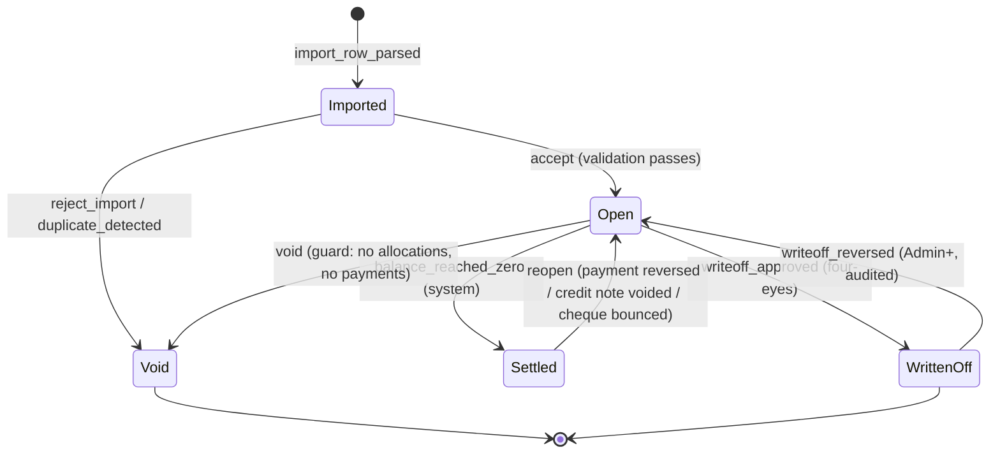
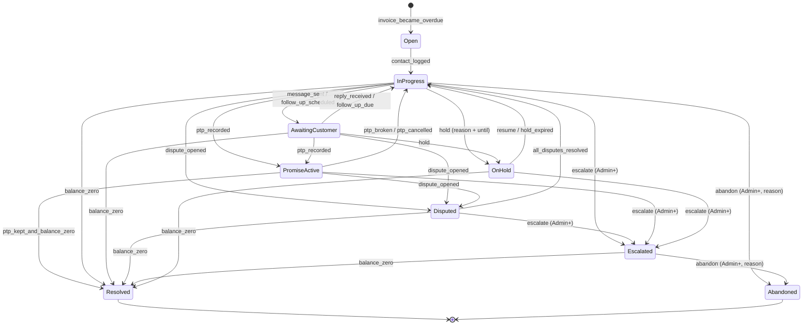
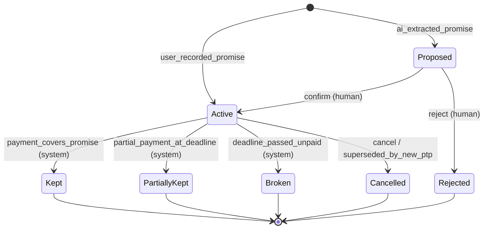
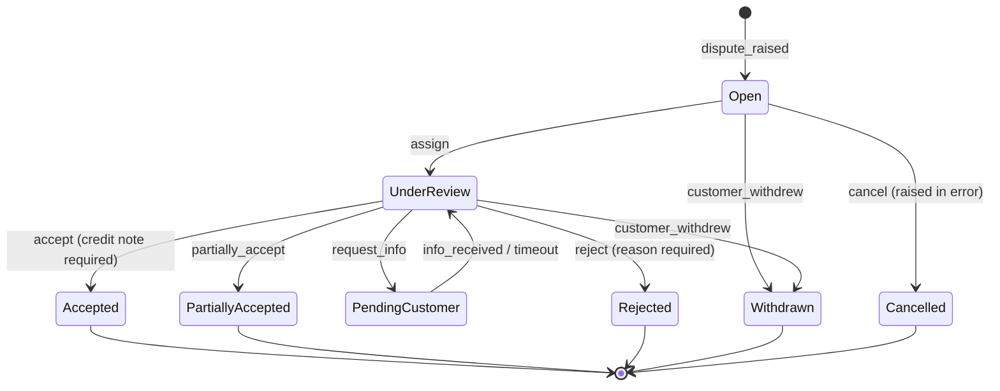

# 02 — State Machines

Status: DRAFT. Normative. Any transition not listed here MUST be rejected by the API
with `409 invalid_transition`, and there MUST be a unit test per illegal transition
(doc 09 §2.1).

## 0. Rules that apply to all four machines

| ID | Rule |
|----|------|
| SM-01 | State is stored as a **string enum** in PostgreSQL (a `text` column with a `CHECK` constraint), never an integer ordinal. Renumbering risk is not worth the bytes. |
| SM-02 | Every transition is executed by exactly one server-side method, in one database transaction, which (a) re-reads the row `FOR UPDATE`, (b) validates the guard, (c) writes the new state, (d) appends an audit event. No code path anywhere may write a state column directly. |
| SM-03 | Every transition records: tenant, entity, from-state, to-state, event, actor (user id **or** `system` **or** `ai_assisted:<suggestion_id>`), timestamp (UTC), reason code, and free-text note. |
| SM-04 | **AI is never an actor.** An AI suggestion can only be an *input* to a human- or system-triggered transition, recorded as `ai_suggestion_id`. There is no transition whose actor is the model (ADR-0003, `CLAUDE.md` → Financial Safety). |
| SM-05 | Terminal states are terminal. Reopening is a **new event that creates a new object or an explicit `Reopen` transition where listed**, never an in-place resurrection that erases history. |
| SM-06 | Time-based transitions (overdue, PTP breach, follow-up due) are evaluated by a scheduled job in the tenant's timezone (`Asia/Amman` by default, A-10) and are idempotent: running the job twice on the same day changes nothing. |
| SM-07 | Concurrency: optimistic concurrency via a `row_version` column. A stale write returns `409 concurrency_conflict` and the UI re-fetches. |

---

## 1. Invoice

### 1.1 Design decision: one stored lifecycle, three derived projections

The word "invoice status" conflates four different things. Conflating them is how AR
systems end up with an invoice that is `Paid` and also has a balance. We split them:

| Facet | Kind | Source of truth |
|-------|------|-----------------|
| **Lifecycle** | **stored** | `invoices.status` — the machine below |
| **Settlement** | derived | computed from allocations: `Unpaid` / `PartiallyPaid` / `Paid` (FIN-10) |
| **Overdue-ness** | derived | `due_date < today(tenant tz)` AND settlement ≠ `Paid` |
| **Dispute** | derived | exists an open dispute on the invoice |

**SM-10** There MUST NOT be an API endpoint, service method, or UI control that sets
settlement, overdue-ness, or dispute directly on an invoice. They are functions of
other rows. (PRD-12.)

**SM-11** The aging report and the queue read the derived facets; they never read a
cached "is_overdue" flag. Any denormalization added later for performance MUST be a
materialized projection rebuilt from the same function, with a nightly reconciliation
test (doc 09 §3.5).

### 1.2 Lifecycle states

| State | Meaning |
|-------|---------|
| `Imported` | Ingested from a file or API but not yet validated/accepted into AR. Not counted in any balance or aging total. |
| `Open` | A live receivable. Counted in AR. This is the only state that generates collection work. |
| `Settled` | Balance is zero by payment, credit note, or a combination. Still queryable, no longer collectible. |
| `WrittenOff` | Balance deliberately abandoned by a human decision with four-eyes approval. Removed from AR aging, retained in history and in a separate write-off report. |
| `Void` | The invoice should never have existed in our system (duplicate import, cancelled before issue). Removed from all totals. Requires zero allocations. |

There is deliberately **no `Draft`** state: we do not create invoices (A-11).
There is deliberately **no `Overdue` or `Disputed` state**: see §1.1.

### 1.3 Diagram

### 1.4 Transition table

| # | From → To | Event | Actor | Guards | Side effects |
|---|-----------|-------|-------|--------|--------------|
| I1 | — → `Imported` | `import_row_parsed` | system (import job) | row passes schema parse | creates invoice; links to `import_batch` |
| I2 | `Imported` → `Open` | `accept` | system on batch commit, or Accountant resolving an exception | FIN-01..FIN-06 all pass; customer resolved; `total_amount ≥ 0`; `due_date ≥ issue_date`; no duplicate `(tenant, customer, invoice_number)` | invoice enters AR; aging includes it; may open/attach a collection case if already overdue |
| I3 | `Imported` → `Void` | `reject_import` | Accountant | none | batch exception recorded |
| I4 | `Open` → `Settled` | `balance_reached_zero` | **system only** | `open_balance == 0` exactly (FIN-10) | closes any open case with reason `paid_in_full`; cancels scheduled follow-ups; PTPs on it resolve as `Kept` if satisfied |
| I5 | `Open` → `WrittenOff` | `writeoff_approved` | Admin/Owner (approver ≠ proposer, PRD-11) | an approved `write_off` record exists; `open_balance > 0`; no open dispute | removes from aging; closes case with reason `written_off`; writes an irreversible audit record |
| I6 | `Open` → `Void` | `void` | Accountant | **zero** allocations, **zero** payments, **zero** credit notes ever applied; no open dispute | closes case with reason `voided` |
| I7 | `Settled` → `Open` | `reopen` | system | an allocation was reversed, a cheque bounced (SM-42), or a credit note was voided, such that `open_balance > 0` | reopens/creates collection case; records `reopen_reason` |
| I8 | `WrittenOff` → `Open` | `writeoff_reversed` | Owner/Admin | explicit reason required | returns to aging with original due date; audit flagged high-severity |

**SM-12** I4 and I7 are the **only** system-driven invoice transitions, and both are
pure consequences of `open_balance` crossing zero. They MUST be implemented as one
function called after every allocation change, and MUST be idempotent.

**SM-13** A payment arriving on a `WrittenOff` invoice is allowed: it triggers I8 then
I4, so the money is recorded and the reversal is visible. It MUST NOT be silently
dropped or held as an unallocated credit.

---

## 2. Collection case

A **collection case** is the unit of collections work: one open case per
(tenant, customer) at a time, covering *all* of that customer's overdue invoices.

**SM-20** Case granularity is **per customer, not per invoice.** You call a person,
not a document. A case references the set of invoices in scope, which grows and
shrinks as invoices age in and get paid.

**SM-21** Uniqueness: a partial unique index guarantees at most one case per customer
in a non-terminal state (doc 04 §5).

### 2.1 States

| State | Meaning |
|-------|---------|
| `Open` | Created, not yet worked. Appears at the top of the queue as new. |
| `InProgress` | At least one contact attempt logged. The normal working state. |
| `AwaitingCustomer` | We have sent something and are waiting; a follow-up date is set. Suppressed from the queue until that date. |
| `PromiseActive` | An active PTP exists. Suppressed from the queue until the promise date (+ grace). Chasing during this window is the fastest way to lose a customer. |
| `Disputed` | At least one open dispute in scope. Collection messaging on disputed invoices is **blocked** (SM-25). |
| `OnHold` | Deliberately paused by a human (customer bereavement, negotiated standstill, Ramadan/holiday courtesy, owner's instruction). Requires a reason and an until-date. |
| `Escalated` | Handed to a human process outside the product (owner call, lawyer, legal notice). **All automation stops permanently for this case** (SM-26). |
| `Resolved` | Everything in scope settled, written off, or voided. Terminal. |
| `Abandoned` | Closed without recovery and without write-off (customer unreachable, amount immaterial). Terminal. |

### 2.2 Diagram

### 2.3 Transition table (selected guards and effects)

| # | From → To | Event | Actor | Guards | Side effects |
|---|-----------|-------|-------|--------|--------------|
| C1 | — → `Open` | `invoice_became_overdue` | system (daily job) | customer has ≥1 `Open` invoice past due beyond the tenant's grace days; no non-terminal case exists | creates case; computes priority; assigns per tenant rule |
| C2 | `Open`/`AwaitingCustomer` → `InProgress` | `contact_logged`, `reply_received`, `follow_up_due` | user or system | — | clears follow-up suppression; surfaces in queue |
| C3 | `InProgress` → `AwaitingCustomer` | `message_sent` | user (send) | a follow-up date is set (default: tenant cadence) | suppresses from queue until `next_action_at` |
| C4 | any active → `PromiseActive` | `ptp_recorded` | user (may be AI-suggested, human-confirmed) | a PTP in `Active` exists (SM-30) | suppresses from queue until promise date + grace; **blocks automated reminders** on covered invoices |
| C5 | `PromiseActive` → `InProgress` | `ptp_broken` | system (job) | promise date + grace passed and covered amount not received | raises priority; records broken-promise count on the customer |
| C6 | any active → `Disputed` | `dispute_opened` | user (may be AI-suggested) | an open dispute exists on ≥1 invoice in scope | **blocks all outbound collection messaging for disputed invoices** (SM-25); starts dispute SLA clock |
| C7 | `Disputed` → `InProgress` | `all_disputes_resolved` | system | no open dispute in scope | re-enables messaging; recomputes priority |
| C8 | active → `OnHold` | `hold` | Accountant+ | reason code + `hold_until` required | suspends all automation until date |
| C9 | active → `Escalated` | `escalate` | **Admin/Owner only** (`cases.escalate`) | reason required; typically after N broken promises or age threshold | **permanently disables automated sending for this case**; notifies Owner |
| C10 | any → `Resolved` | `balance_zero` | system | every invoice in scope is `Settled`, `WrittenOff` or `Void` | closes PTPs (`Kept`/`Superseded`), cancels follow-ups |
| C11 | any → `Abandoned` | `abandon` | Admin/Owner | reason required | invoices stay `Open` in aging unless separately written off — abandonment is **not** a write-off (FIN-33) |

**SM-25** While a case is `Disputed`, the system MUST NOT send any dunning message
referencing a disputed invoice. Messages about *undisputed* invoices in the same case
are allowed only if the tenant setting `allow_split_dunning_during_dispute` is on
(default **off**).

**SM-26** `Escalated` is a one-way door for automation: no scheduled message, no AI
draft auto-send, no reminder. AI may still summarise. Only `Resolved` or `Abandoned`
follow. This implements `CLAUDE.md` → "AI may never initiate legal escalation."

**SM-27** A case's priority score is recomputed on every transition and nightly. It is
a **product ranking heuristic, not a monetary figure**, and is computed in C# from
stored decimals (doc 03 §8).

---

## 3. Promise-to-Pay (PTP)

A PTP is a *commitment*, captured from a reply, a call, or a message: "I will pay
X by date D". It is **not** a payment, not a receivable, and never affects a balance.

**SM-30** A PTP MUST record: covered invoices (≥1), promised amount (`decimal`),
promised date, source (`call`, `email`, `whatsapp`, `in_person`, `ai_suggested`),
the capturing user, and — if AI-derived — `ai_suggestion_id`, model, prompt version,
confidence.

**SM-31** **An AI classification of "customer promised to pay" MUST NOT create an
`Active` PTP.** It creates a PTP in `Proposed`, which a human confirms. This is the
direct analogue of the `CLAUDE.md` rule about AI classifying "paid".

**SM-32** A PTP's promised amount MAY be less than the covered balance (partial
promise). It MUST NOT exceed the covered open balance at capture time by more than
the tenant's tolerance (default: not at all) — otherwise the capture is wrong.

### 3.1 States

| State | Meaning |
|-------|---------|
| `Proposed` | Extracted by AI or drafted by a user; not yet confirmed. Has **no** effect on the queue. |
| `Active` | Confirmed by a human. Suppresses chasing until the promise date + grace. |
| `Kept` | Sufficient payment received by promise date + grace. Terminal, positive. |
| `PartiallyKept` | Some but not all of the promised amount arrived in the window. Terminal; counts as broken for reliability scoring but is displayed distinctly. |
| `Broken` | Nothing (or below the partial threshold) arrived by the deadline. Terminal, negative. |
| `Cancelled` | Withdrawn by the customer or the user before the date, or superseded by a renegotiated promise. Terminal, neutral. |
| `Rejected` | A `Proposed` PTP a human declined (misclassification). Terminal; **fed back into the AI evaluation set** (doc 09 §5.4). |

### 3.2 Diagram

### 3.3 Evaluation rules

| ID | Rule |
|----|------|
| SM-33 | Evaluation runs on `promised_date + grace_days` (tenant setting, default 2 **business** days, A-08) at 06:00 tenant time. |
| SM-34 | "Payment received" means: allocations to the covered invoices with `received_date` in `[created_at, deadline]` summing to ≥ promised amount. **Cheques count only when `Cleared`** (SM-42) — a post-dated cheque handed over is itself a promise, not a payment. |
| SM-35 | `PartiallyKept` threshold: received ≥ 50% of promised (tenant-configurable), else `Broken`. |
| SM-36 | Recording a new PTP covering any of the same invoices while one is `Active` MUST `Cancel` the earlier one with reason `superseded`, linked by `superseded_by_id`. Overlapping active promises are forbidden. |
| SM-37 | A customer's **promise reliability** = kept / (kept + partially kept + broken) over the trailing 12 months, shown as a badge and used in case priority (doc 03 §8). It MUST show the denominator ("2 of 3 kept"), never a bare percentage on tiny samples. |

---

## 4. Dispute

A dispute is a customer's assertion that some or all of an invoice is not owed.

**SM-40** A dispute is always attached to **one invoice** (and optionally specific
lines). A customer disputing three invoices creates three disputes, grouped in the
case. This keeps the balance impact unambiguous.

**SM-41** An open dispute **does not change the invoice balance**. It marks the amount
as `disputed_amount`, which the aging report shows as a separate column and which the
queue uses to suppress chasing. Only a credit note or a payment changes a balance
(FIN-20).

### 4.1 States

| State | Meaning |
|-------|---------|
| `Open` | Raised, not yet investigated. Blocks dunning on the invoice. |
| `UnderReview` | Assigned to someone; evidence being gathered. SLA clock running. |
| `PendingCustomer` | We asked the customer for information and are waiting. SLA clock paused. |
| `Accepted` | We agree, wholly or partly. Requires a resolution amount. **Leads to a credit note** — the dispute itself never writes anything off. |
| `Rejected` | We disagree; the amount stands. Requires a reason and, if tenant policy says so, evidence. |
| `PartiallyAccepted` | Split: part credited, part stands. Requires both a credit amount and a reason. |
| `Withdrawn` | Customer dropped it. |
| `Cancelled` | Raised in error by our side. |

`Accepted`, `Rejected`, `PartiallyAccepted`, `Withdrawn`, `Cancelled` are terminal.

### 4.2 Diagram

### 4.3 Rules

| ID | Rule |
|----|------|
| SM-43 | Reason codes are a **closed set**: `wrong_amount`, `wrong_quantity`, `price_mismatch`, `goods_not_received`, `goods_damaged`, `service_not_delivered`, `duplicate_invoice`, `already_paid`, `missing_po_reference`, `wrong_tax_treatment`, `wrong_entity_billed`, `contract_terms`, `other`. AI may only ever emit a value from this set (doc 07 §4). |
| SM-44 | `already_paid` is special: it MUST open a **payment verification task** rather than a normal dispute investigation (`CLAUDE.md`: AI classifying "paid" creates verification, never a paid mark). |
| SM-45 | Transition to `Accepted`/`PartiallyAccepted` MUST be atomic with the creation of a credit note for the accepted amount, in one transaction. A dispute cannot be "accepted" without the money moving in the model. |
| SM-46 | The accepted amount MUST NOT exceed the invoice's open balance at resolution time. |
| SM-47 | Resolving a dispute MUST require `disputes.resolve`. `Collector` can raise and update, never resolve (PRD §5.1). |
| SM-48 | SLA: `first_response_due_at` = raised + 2 business days; `resolution_due_at` = raised + 10 business days (tenant-configurable). Breaches surface in the queue and the daily briefing. `PendingCustomer` pauses `resolution_due_at`. |
| SM-49 | AI may **propose** a dispute from a customer reply (`Open`, `source = ai_suggested`, human confirms). AI MUST NOT resolve, accept, reject, or set the disputed amount authoritatively — the amount it extracts is a *suggestion* a human types or confirms (doc 07 §4). |

---

## 5. Cross-machine interactions (the part that breaks in production)

| ID | Rule |
|----|------|
| SM-50 | **Payment → everything.** Recording an allocation triggers, in order, in one transaction: recompute invoice balance → invoice I4/I7 → PTP evaluation → case C10 → cancel scheduled messages for now-settled invoices. |
| SM-51 | **Cheque lifecycle.** `Received` → `Deposited` → `Cleared` \| `Bounced`. Only `Cleared` creates an allocation. `Bounced` reverses any provisional allocation (I7), reopens the case at raised priority, and records `bounced_cheque` on the customer. A post-dated cheque SHOULD also create an `Active` PTP dated to the cheque date (A-05). |
| SM-52 | **Dispute wins over promise.** If a dispute opens on an invoice covered by an `Active` PTP, the case moves to `Disputed` and the PTP stays `Active` but stops driving reminders. |
| SM-53 | **Escalation wins over everything.** In `Escalated`, no automated transition may send a message. Time-based transitions still *record* (a PTP still breaks) but produce no outbound action. |
| SM-54 | **Write-off requires quiet.** `writeoff_approved` (I5) is blocked while any dispute on the invoice is open or any PTP on it is `Active`. |
| SM-55 | **Void is the narrowest door.** I6 requires zero financial history. If money ever touched the invoice, the correct instrument is a credit note, not a void. |
